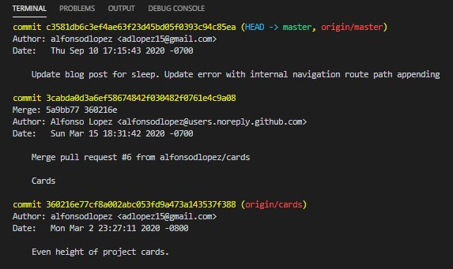

When I first started programming on my own, GitHub seemed to be some tool only large corporations used. I only learned about it in passing from my professional developer friends. It would take me a couple of years to get around to learning more about Git and version control. Once I did, I wished I had done it sooner. 

Like many starting out, I had copies of this file and that file, and countless blocks of commented code to test out a function in my scripts. This would come to join my list of "things I wish I learned when I got started". I would soon learn that almost all code I wrote would benefit from version control systems, and even my non-technical colleagues would benefit from some knowledge of GitHub to learn how engineering processes worked, and even to perform for simpler tasks such as updating product documentation.

Below I'll discuss the version control system, Git, Github is based on. Then, I will share how you can get started with a simple workflow using Git and Github in your own repository. I will assume that you have already [set-up Git and GitHub](https://docs.github.com/en/github/getting-started-with-github/set-up-git)

# Version Control
Version control systems allow developers to build features in an asynchronous fashion. In practice this means that you track files within your project, merge changes from multiple developers, and easily undo the bad ones. They offer some very nice capabilities to anyone be it the solo developer to the largest enterprises in the world. 

## Branching
For many, this is the major value add of version control. If you and your colleagues are working on the same application, you're going to want to get a few logistics in place. In practice, you'll commonly have a "master" branch. This is the production level code that your users or organization uses. As a developer, no one should be working directly on the master branch. It is all too easy to make changes to live code and break it.

Instead, everyone downloads a copy of the master branch, then replicates it to a new "feature" branch for themselves to work on. This copy is an isolated line of development. Now you can focus on developing a new feature or version of your application without affecting the master version. Have a friend you want to help you with your new feature? They can make a copy of your feature branch and work on their local copy in parallel. Need to drop what your doing to fix a major bug? Create a bug-bashing feature branch without affecting your new feature. Having multiple branches to isolate your changes is very powerful.

## Merging
You've just finished patching a bug in a feature branch. Now you want to bring that change back into the master branch. You can easily incorporate the change by merging the feature branch into your master branch. 

When two branches merge, all of the commits made to the feature branch are replayed onto the branch it is being merged into. This way the history of the work being incorporated is maintained.


## Accountability
Let's say you're on vacation, and another developer needs to finish up a feature you were working on. Maybe they did a great job and you want to give them well deserved kudos. You can easily do this by using the infamous `git blame` command to see all of the authors who contributed to that file.

```powershell
git blame [myFileName]
```


Here you can see how git records the ID of the commit (the change to the file or project) on the left, the user who made the commit, the timestamp when it occurred, and the line associated with that commit.

## Record Keeping

All too often, record keeping is not appreciated until you need it. For example, your project has been actively incorporating changes for the past few months. Last week a bug was introduced in a merge and just identified. Did you right the code or one of your contributors? What was the commit that introducced the bug? Was the commit stand alone or was other work built on top of it in the past week? What changes will you lose if you roll back to the commit before that?

Version control allows you quickly and easily review what got committed and when. Below I can see exactly when the most recent commits to this project were along with information about who make the contribution and a short message describing the work done. If I wanted to dig deepering I could review the code in more detail at the commit level.

```
git log
```



# Why Git?

There are other version control systems out there. The main reason I like Git is because it is decentralized. It is installed locally and runs as both the client and the server. Some other systems (notable Apache Subversion or SVN for short) requires a centralized server, which is now a single point of failure. 

Git encourages collaboration. Anyone can copy a public repository. No permission is required from the original creator. If you believe you can make the project better or create a spin-off for your own needs there is nothing to stop you. You can work on a copy locally and offer contributions or branch off and create your own project with it. No repository out there is more important than anyone elses. For example, there are hundreds of Linux based operating systems out there. Each built on the Linux kernal. Some are even derivations of other Linux based operating systems.

Finally, there is a concept of atomic commits that other version control systems do not have. If I have made 100 changes recently to a project, I may not want to commit all of then. I may feel comfortable committing 50. Each of which can be independantly committed. I am free to update the main project without being required to commit the entire change set, which is wonderful for managing my workflow.

# Working with Git and GitHub

## Terminology

Your **repository** is the container or virtual storage of your __entire__ project. It contains all saved versions of your project including individual lines of development, or **branches**. You can always go back through your history to see your previous saved states. You can also jump between branches such as the "master" branch, and a branch you may be working on to develop a new feature. Generally you will have a **local repository** on your machine and a **remote repository** which lives elsewhere. For this article, it's going to be the our repository hosted on GitHub. 

The **working tree**, or working directory, is where you actually do your work to view and modify files in your project. Git tracks the difference between your working directory and your local repository, and between your local repository and a remote repository. Changing your current branch also changes your working directory.

One catch for new users is not staging modifications. Git only tracks your work when a file or folder (and contents of said folder) have been added to the **staging area**. Until a file is added to the staging environment your work will be considered "untrack modifications". 

Note: If you have files you never want tracked (such as your credentials stored in a file) you can prevent Git from tracking using a [".gitignore"](https://git-scm.com/docs/gitignore) file.

With your work nearly complete and files staged, you'll need to When you are ready to promote your work, you will add your modifications in the form of **commits**. These are snapshots of the current changes in a project. Think of it as the eqivalent of a save file. You will tell Git explicitly which changes to save from your staging area to your local repository. 

Up until now, your work has resided on your local machine. The next step is to upload the contents of your local repository to your remote repository. Transferring your commits from your local to your remote repository is a **push**. You're telling Git "record the changes on this branch in my repository to that branch on the remote repository".

If we want to go in the reverse direction, it's fairly simple knowing the above. To pull commits from a remote repository, we use `git pull` to import into our local repository. To bring the a saved state of our local repository into our working directory, we use `git checkout`.


## Workflow

There are many ways you can set-up a workflow with Git. You have the ability to set permissions on branches and repositories which allows strict control over a branch or repository. In fact, [Git's documentation](https://git-scm.com/about/distributed) shares a few different workflows you may consider for your own projects.

For my project, I want to initialize my new repository right away to track my work. I've created a new folder for my project and open it up in the terminal. To initialize my Git repository within my project I use `git init`. 

Next I perform some work and create my main.py file. I'm ready to track this file using `git add .` If you're not familiar with the terminal, a single period indicates your current directory. This command means that I am adding all of the contents of my current directory to my staging area. In this case, I've only created a new empty file, but this is enough to track. 


Now I want to push this change to a remote repository. The issue at this point is that I don't have one to push to. I'll go to my account in GitHub to create one.


If I don't initialize any files, GitHub will provide insstructions on how to setup the remote reference from your local repository to the remote repository. This will allow me to push from my local to machine to the repository hosted on GitHub. 


`git branch` by itself will list all current branches. The `-M` flag tells Git to rename a branch and reset it to the start point. The next command I will skip the `-u` flag as it is outside the scope of this article, however necessary to set-up your remote reference. The last two keywords are of interest "origin master". There is no keyword "origin" or "master". These are simply conventions used in Git. "Origin" refers to the remote repository that you have configured for this project, it is usually hosted on GitHub itself. "Master", as noted previously, is the convention for the main branch your ready-to-serve code is held. Taken all together `git push -u origin master` tells Git to push commits from my local repository to the branch named "master" on the configured remote URL.


After being prompted for my passphrase, the first push to my repository on GitHub is a success!


Indeed, my work is now on my remote repository for myself and others to use. If my computer explodes, or I make I will be able to refer back to this repository and pull the contents back down using `git clone`.


Just like that, I was able to simply pull the entire repository back into my local machine. You only need to do this if you need to start a pull an entire project and get it set-up on your local machine. The great thing about Git and GitHub's open-source nature is that you can start searching projects you are interested in and clone your own copy to start working on. For your average day-to-day work, all you will want is the most recent changes to a remote repository. This can be done with `git pull`